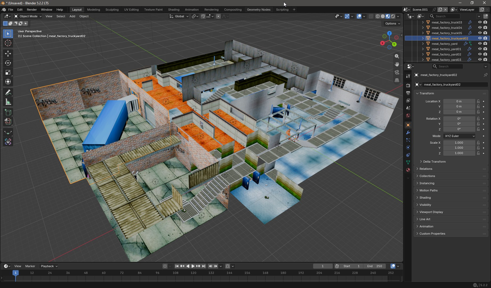
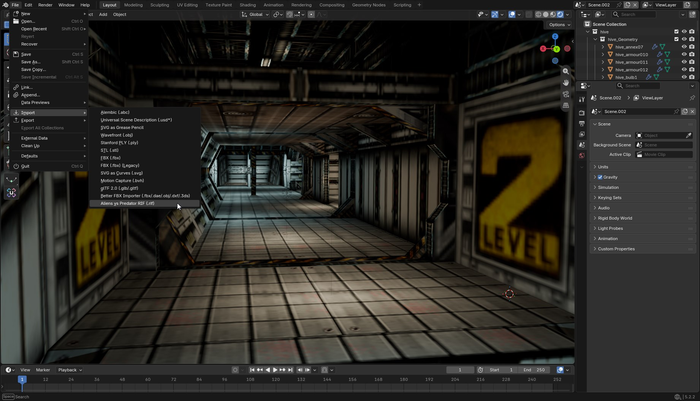
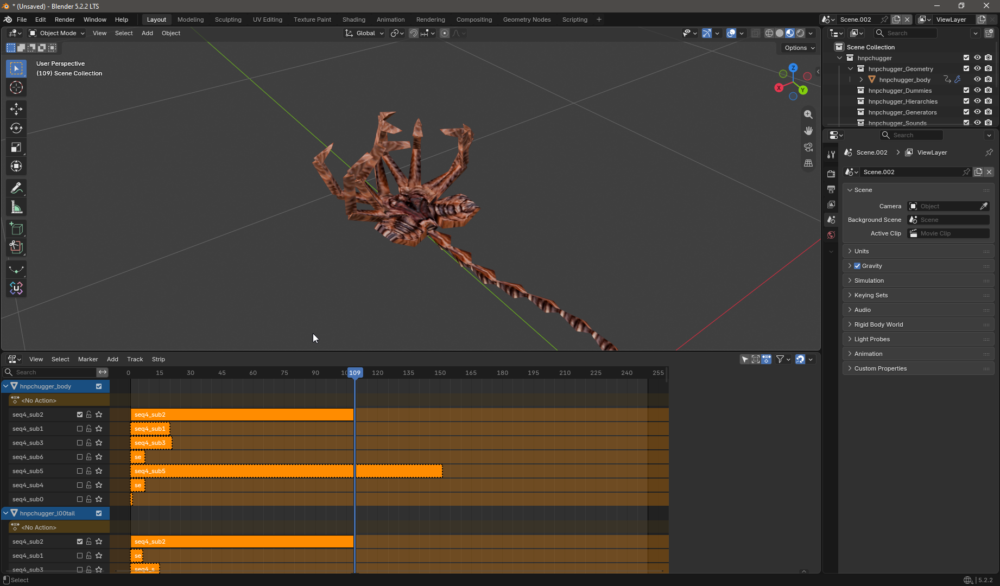

# AvP RIF Importer

Blender add-on that imports models, levels, characters, textures and
animations from **Aliens vs Predator (1999, Rebellion)** into a
Blender scene. Materials are set up for Eevee by default.

---

## Features

- **Geometry** — static meshes with UVs, per-shape materials, and
  correct pivots.
- **Textures** — loaded from the game's archives, with palette
  tinting for untextured polygons.
- **Lighting** — point and spot lights placed per level.
- **Level animations** — doors, lifts, moving platforms, rotating
  fans.
- **Character animations** — rigged armatures with per-sequence NLA
  tracks.
- **Level data** — spawn points, camera origins, AI paths, sound
  emitters, and other markers.

---

## Requirements

- **Blender 4.2 or newer.**
- **Aliens vs Predator (1999) game files** with the `shape_rifs/`
  directory from the *AvP Editing Tools* package placed next to the
  other game asset folders. The importer needs it to resolve external
  shape references used by many levels.
- **A `fastfile/` directory** (part of the standard game install) if
  you want textures to be extracted from the FFL archives.

The importer locates these folders automatically by scanning
directories near the `.RIF` file you open, so keeping them in the
game's default layout is enough — no manual path configuration is
required.

---

## Installation

### Blender 4.2+ (Extensions platform)

Once the add-on is listed on
[extensions.blender.org](https://extensions.blender.org/), it can be
installed from Blender:

1. Open **Edit → Preferences → Get Extensions**.
2. Search for **Aliens vs Predator RIF Importer**.
3. Click **Install**.

### Blender 4.2 – 5.x (manual ZIP)

1. Download `avp_rif_importer.zip` from the
   [latest release](https://github.com/AdiJager/BlendRIF/releases).
2. Open **Edit → Preferences → Add-ons**.
3. Click **Install from Disk…** and select the ZIP.
4. Enable the checkbox next to **Aliens vs Predator RIF Importer**.

If you are upgrading from an earlier version, remove the old add-on
first and restart Blender — reinstalling the ZIP alone is not enough
because Blender keeps the previous module in memory until restart.

---

## Usage

1. **File → Import → Aliens vs Predator RIF (.rif)**.
2. Pick a `.RIF` file. The importer locates the game's asset folders
   automatically from directories near the file.
3. Pick a preset or tweak the options (see below).
4. Click **Import**.

Imported objects land in a `<filename>_<tag>` collection tree
(`geometry`, `empties`, `lights`, `animations`, optionally
`missing_ext`), so different imports stay separated.

For character animations, the default sequence is unmuted on every
bone — switch between sequences in the NLA editor to preview the rest.

### Options

**Preset** — a quick configuration bundle. **Default** imports
everything; **Fast** imports geometry only; **Debug** disables
smoothing and pivot fixes and marks unresolved references. Presets
overwrite the individual settings below; you can still tweak them
afterwards.

**Geometry**
- **Scale World** — global scale for the imported scene. The default
  `0.001` gives a near-real-world size.
- **Pivot Mode** — whether to recenter object pivots. `Rotated only`
  recenters just the rotated ones; `None` keeps them as stored;
  `All` recenters everything (debug).
- **External RIF** — how to pick between a placeholder shape and a
  shape from an external RIF when both are available. `Auto` picks
  the one with more vertices; `Prefer ext` / `Prefer placeholder`
  force a side.
- **Orphan Shapes** — what to do with shapes the game does not
  render. `Skip` matches the game; `Keep at origin` and `Infer` are
  for debugging.
- **Auto Smooth** — apply smooth shading to imported meshes with the
  given hard-edge angle.

**Materials**
- **Import Materials** — master toggle for all texture and material
  work. Turn off for a fast geometry-only pass.
- **Bitmap Mode** — choose between the low-res (`LO12`) and
  high-res (`HI12`) texture set.
- **Use MATCHIMG** — apply the game's built-in texture substitution
  rules.
- **Use CLRLOOKP** — use the game's color palette to tint polygons
  that have no texture. Without this they fall back to magenta.
- **Backface Culling** — match the game's renderer, which hides
  designer geometry that is invisible in-game. Turn off to inspect
  that geometry in Blender.
- **Extract FFL** — unpack textures from the game's FFL archives
  before importing. Disabled automatically when Import Materials is
  off.

**Data** — one toggle per marker type: attachment points, placed-
object hierarchy, dynamic spawn points, sound emitters, player
starts, camera origins, AI paths (curves), and lights.

**Animation**
- **Animate Level Tracks** — animated objects as NLA strips.
- **FPS** — animation playback rate. The default `60` matches the
  game's native tick.
- **Animate Characters** — bake character animation sequences as NLA
  tracks per bone.
- **Sequences per Bone** — cap how many sequences are baked per
  bone. `0` bakes everything, which can produce hundreds of tracks
  on large characters.

**Debug**
- **Diagnostic Mode** — parse and log the file without creating any
  Blender data.
- **Mark Missing SHPEXTFL** — drop an Empty at every external
  reference that could not be resolved, so you can see where it was
  in-game.

### Example: importing a level

    File > Import > Aliens vs Predator RIF (.rif)
      -> D:\...\Aliens versus Predator Classic\avp_rifs\Lockdown4.RIF
    Preset: Default
    Import

Result: geometry collection, marker empties, lights, NLA tracks for
moving objects, textures loaded from the game's FFL archives
(extracted on the first import, reused afterwards).

### Example: importing a character

    File > Import > Aliens vs Predator RIF (.rif)
      -> D:\...\Aliens versus Predator Classic\avp_huds\hnpc_civvie.RIF
    Preset: Default
    Import

Result: an armature with the full bone hierarchy, meshes bound to
it, and NLA tracks per animation sequence. The default sequence is
unmuted on every bone; other sequences can be previewed via the NLA
editor.

---

## Limitations

- **Import only.** There is no export back to `.RIF`.
- **Character animations are baked.** The NLA tracks are independent
  of a source action; editing them by hand is possible but not
  supported.
- **Not imported:** fragment systems, animated UVs, module
  streaming, vertex tint, morph targets, and sprites.
- **Tested on Blender 4.2 – 5.2.** Older versions may work but are
  untested.

---

## Diagnostic tools

The legacy ZIP ships a `tools/` folder with standalone dump scripts
(`dump_chunks.py`, `dump_char_chunks.py`). They are meant to be pasted
into Blender's Scripting workspace and run there — useful when
inspecting unfamiliar RIF files or debugging an import. They are
never imported by the add-on itself and have no effect on startup
cost or behaviour.

---

## Credits

- **AdiJager** — author; design, RIF format research, extensive
  testing against AvP Classic (1999) assets.
- **DeepSeek** — pair-programming assistant across the parser, mesh
  pipeline, character animation and packaging layers.
- **The AvP (1999) developers** — for publishing the original source
  code, which made format reverse-engineering viable.
- Built with the Blender Python API. No external dependencies.

---

## License

GPL-3.0-or-later. See [LICENSE](LICENSE).